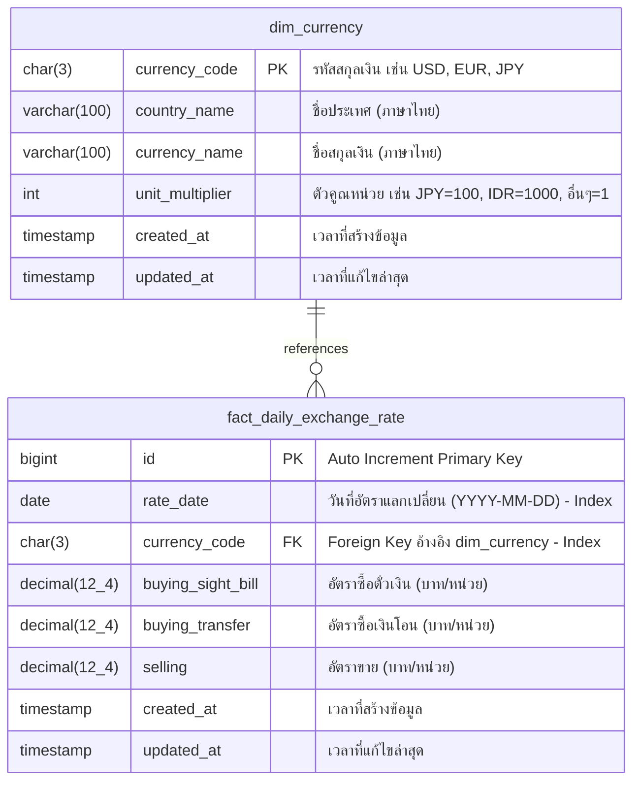

# Bank of Thailand (BOT) Exchange Rate Data Pipeline & Database

ระบบ Data Pipeline และฐานข้อมูล MariaDB/MySQL (XAMPP) สำหรับรวบรวม จัดโครงสร้าง และอัปเดตข้อมูลอัตราแลกเปลี่ยนเงินตราต่างประเทศรายวันจากธนาคารแห่งประเทศไทย (BOT) ตั้งแต่ปี 2002 ถึงปัจจุบัน

---

## 1. สถาปัตยกรรมระบบและโครงสร้างฐานข้อมูล (ER-Diagram)

ข้อมูลถูกออกแบบตามหลัก **Star Schema** เพื่อรองรับการนำไปวิเคราะห์ต่อบน Power BI, Tableau หรือ SQL Analytics ได้อย่างสะดวกรวดเร็ว:



---

## 2. โครงสร้างโฟลเดอร์ของโปรเจกต์ (Project Structure)

```text
d:\MySQL\mysql\
├── BOT_csv_raw_data/              # โฟลเดอร์เก็บไฟล์ CSV ข้อมูลดิบ
│   ├── BOT Exchange Rate 02-24 Raw(Exchange Rate 02-24).csv
│   └── EX_BOT_EX_Raw.csv
├── config/                        # การตั้งค่าระบบและการเชื่อมต่อฐานข้อมูล
│   └── db_config.py
├── database/                      # DDL และเอกสาร Data Dictionary
│   ├── schema.sql
│   ├── init_db.py
│   └── data_dictionary.md
├── etl/                           # โมดูล Transform และ Ingestion
│   ├── __init__.py
│   ├── transformers.py
│   └── loaders.py
├── scripts/                       # สคริปต์สำหรับรันการทำงาน
│   ├── ingest_historical.py       # รัน Backfill ข้อมูลย้อนหลังทั้งหมด
│   ├── ingest_monthly.py          # รันอัปเดตไฟล์ Batch รายเดือนใหม่
│   └── verify_database.py         # ตรวจสอบความถูกต้องและคุณภาพข้อมูล
├── .env                           # Credentials เชื่อมต่อฐานข้อมูล
└── README.md                      # คู่มือการใช้งานระบบ
```

---

## 3. กฎเกณฑ์การแปลงข้อมูล (Business Transformation Rules)

1. **การแปลงประเภทอัตราแลกเปลี่ยน (Rate Type Mapping):**
   - `ซื้อตั๋วเงิน` $\rightarrow$ `buying_sight_bill`
   - `ซื้อเงินโอน`, `ซื้อเงินโอน 1/`, `ซื้อ` (ของ 29 สกุลเงินรอง) $\rightarrow$ `buying_transfer`
   - `ขาย` $\rightarrow$ `selling`
   - `อัตรากลาง` $\rightarrow$ ตัดทิ้ง (สามารถคำนวณแบบ Dynamic ได้เสมอใน Power BI / SQL ด้วยสูตร `(buying_transfer + selling) / 2`)
2. **การแปลงรูปแบบวันที่ (Date Standardization):**
   - ไฟล์ประวัติศาสตร์ (`MM/DD/YYYY`) และไฟล์รายเดือน (`DD/MM/YYYY`) $\rightarrow$ แปลงเป็นมาตรฐาน ISO `YYYY-MM-DD` (`DATE`)
3. **การรับประกัน Idempotency:**
   - ใช้ `UNIQUE KEY (rate_date, currency_code)` ควบคู่กับคำสั่ง `ON DUPLICATE KEY UPDATE` ทำให้สามารถรันซ้ำกี่ครั้งก็ได้โดยไม่เกิดข้อมูลซ้ำซ้อน

---

## 4. วิธีการใช้งานสคริปต์ (How to Run)

### 4.1 เริ่มต้นสร้างตารางฐานข้อมูล

```powershell
python database/init_db.py
```

### 4.2 นำเข้าข้อมูลประวัติศาสตร์ทั้งหมด (2002–2026)

```powershell
python scripts/ingest_historical.py
```

### 4.3 นำเข้าไฟล์อัปเดตรายเดือนใหม่ (Monthly Batch Update)

เมื่อมีไฟล์ CSV รายเดือนใหม่เข้ามา สามารถรันคำสั่ง:
รันจาก Root Directory ของโปรเจกต์ D:\MySQL\mysql

```powershell
python scripts/ingest_monthly.py --file "D:\path\to\your_monthly_file.csv"

ตัวอย่าง
python scripts/ingest_monthly.py --file "D:\MySQL\mysql\BOT_csv_raw_data\EX_BOT_EX_Raw_2026_08.csv"

ระบบจะทำการ Validate สกุลเงิน, ทำความสะอาดข้อมูล, แปลงวันที่เป็น YYYY-MM-DD และ Upsert ข้อมูลลง MySQL ให้อัตโนมัติ โดยไม่เกิดปัญหาข้อมูลซ้ำซ้อน (Idempotent)

```

### 4.4 ตรวจสอบคุณภาพและความสมบูรณ์ของข้อมูล (Data Verification)

```powershell
python scripts/verify_database.py
```

---

## 5. สรุปผลการตรวจสอบข้อมูลล่าสุด (Verification Summary)

- **จำนวนสกุลเงินในระบบ (`dim_currency`):** 48 สกุลเงิน (พร้อมชื่อประเทศ, ชื่อสกุลเงิน, ตัวคูณหน่วยคำนวณ)
- **จำนวนรายการอัตราแลกเปลี่ยน (`fact_daily_exchange_rate`):** 259,670 แถว
- **ช่วงเวลาข้อมูล:** 2 มกราคม 2002 ถึง 31 กรกฎาคม 2026 (รวม 5,932 วันทำการ)
- **ความสมบูรณ์:** ไม่มีแถวใดที่ค่าอัตราแลกเปลี่ยนเป็น NULL ทั้งหมด (`0 anomalies`)
