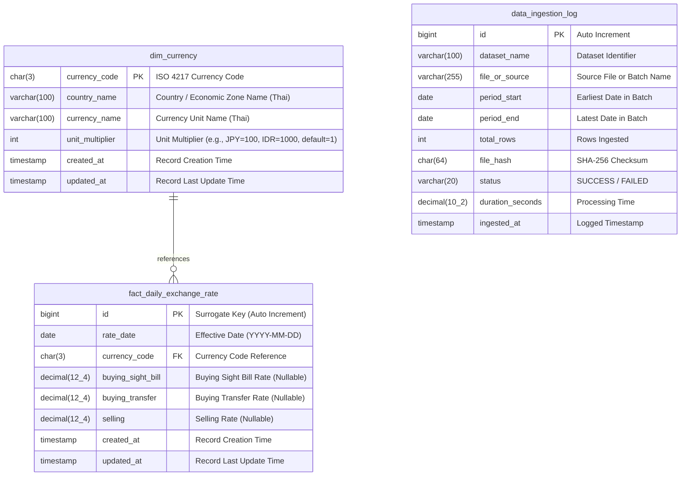

# Data Dictionary & Entity-Relationship Documentation

## 1. Visual ER-Diagram

---

## 2. Table: `dim_currency`

| Column Name | Data Type | Constraints | Nullable | Default | Description |
| :--- | :--- | :--- | :--- | :--- | :--- |
| `currency_code` | `CHAR(3)` | `PRIMARY KEY` | No | - | รหัสสกุลเงินมาตรฐาน ISO 4217 เช่น USD, JPY, EUR |
| `country_name` | `VARCHAR(100)` | - | No | - | ชื่อประเทศหรือเขตเศรษฐกิจ (ภาษาไทย) เช่น สหรัฐอเมริกา, ญี่ปุ่น |
| `currency_name` | `VARCHAR(100)` | - | No | - | ชื่อหน่วยสกุลเงิน (ภาษาไทย) เช่น ดอลลาร์, เยน, ยูโร |
| `unit_multiplier` | `INT` | - | No | `1` | ตัวคูณต่อหน่วยคำนวณอัตราแลกเปลี่ยน (เช่น JPY = 100, IDR = 1000) |
| `created_at` | `TIMESTAMP` | - | No | `CURRENT_TIMESTAMP` | วันที่และเวลาที่บันทึกข้อมูลเข้าระบบ |
| `updated_at` | `TIMESTAMP` | - | No | `CURRENT_TIMESTAMP ON UPDATE` | วันที่และเวลาที่แก้ไขข้อมูลล่าสุด |

---

## 3. Table: `fact_daily_exchange_rate`

| Column Name | Data Type | Constraints | Nullable | Default | Description |
| :--- | :--- | :--- | :--- | :--- | :--- |
| `id` | `BIGINT` | `PRIMARY KEY`, `AUTO_INCREMENT` | No | - | รหัส Primary Key ลำดับรายการ |
| `rate_date` | `DATE` | `INDEX`, `UNIQUE (rate_date, currency_code)` | No | - | วันที่มีผลบังคับใช้อัตราแลกเปลี่ยน (มาตรฐาน `YYYY-MM-DD`) |
| `currency_code` | `CHAR(3)` | `FOREIGN KEY` $\rightarrow$ `dim_currency.currency_code` | No | - | รหัสสกุลเงิน 3 หลัก |
| `buying_sight_bill`| `DECIMAL(12, 4)` | - | Yes | `NULL` | อัตราซื้อตั๋วเงิน (บาท/หน่วย) |
| `buying_transfer` | `DECIMAL(12, 4)` | - | Yes | `NULL` | อัตราซื้อเงินโอน (บาท/หน่วย) รวมเรทซื้อของสกุลเงินรองและ PKR |
| `selling` | `DECIMAL(12, 4)` | - | Yes | `NULL` | อัตราขาย (บาท/หน่วย) |
| `created_at` | `TIMESTAMP` | - | No | `CURRENT_TIMESTAMP` | วันที่และเวลาที่บันทึกข้อมูลเข้าระบบ |
| `updated_at` | `TIMESTAMP` | - | No | `CURRENT_TIMESTAMP ON UPDATE` | วันที่และเวลาที่แก้ไขข้อมูลล่าสุด |

---

## 4. Table: `data_ingestion_log`

| Column Name | Data Type | Constraints | Nullable | Default | Description |
| :--- | :--- | :--- | :--- | :--- | :--- |
| `id` | `BIGINT` | `PRIMARY KEY`, `AUTO_INCREMENT` | No | - | รหัสลำดับ Audit Log |
| `dataset_name` | `VARCHAR(100)` | `INDEX` | No | - | ชื่อชุดข้อมูล เช่น `historical_backfill`, `monthly_batch` |
| `file_or_source`| `VARCHAR(255)` | `INDEX` | No | - | ชื่อไฟล์หรือ Batch Source |
| `period_start` | `DATE` | - | Yes | `NULL` | วันที่เริ่มต้นของข้อมูลในงวด |
| `period_end` | `DATE` | - | Yes | `NULL` | วันที่สิ้นสุดของข้อมูลในงวด |
| `total_rows` | `INT` | - | No | `0` | จำนวนแถวที่นำเข้าสำเร็จ |
| `file_hash` | `CHAR(64)` | - | Yes | `NULL` | SHA-256 Checksum ของไฟล์ต้นฉบับ |
| `status` | `VARCHAR(20)` | - | No | `'SUCCESS'` | สถานะการทำงาน (`SUCCESS`, `FAILED`) |
| `duration_seconds`| `DECIMAL(10, 2)`| - | Yes | `NULL` | ระยะเวลาประมวลผล (วินาที) |
| `ingested_at` | `TIMESTAMP` | - | No | `CURRENT_TIMESTAMP` | เวลาที่โหลดข้อมูล |

---

## 5. Business Transformation & Ingestion Rules
1. **Date Normalization:**
   - Input format `MM/DD/YYYY` (File 1) and `DD/MM/YYYY` (File 2) $\rightarrow$ Converted to `YYYY-MM-DD`.
2. **Type Mapping & Clean:**
   - `ซื้อตั๋วเงิน` $\rightarrow$ `buying_sight_bill`
   - `ซื้อเงินโอน`, `ซื้อเงินโอน 1/`, `ซื้อ` $\rightarrow$ `buying_transfer`
   - `ขาย` $\rightarrow$ `selling`
   - `อัตรากลาง` $\rightarrow$ ตัดทิ้ง (สามารถคำนวณแบบ dynamic เป็น `(buying_transfer + selling)/2` ได้)
3. **Idempotency Strategy:**
   - Ingestion uses `INSERT INTO fact_daily_exchange_rate (...) VALUES (...) ON DUPLICATE KEY UPDATE buying_sight_bill=VALUES(buying_sight_bill), buying_transfer=VALUES(buying_transfer), selling=VALUES(selling)`.
