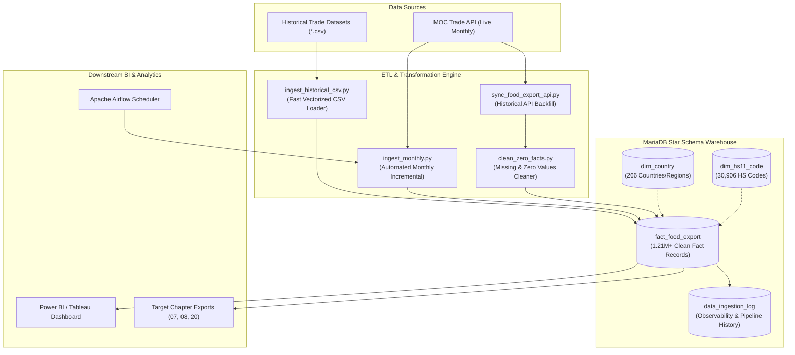

# Data Pipeline & Warehouse: Thailand Food Export (`food_export`)

## 1. System Overview & Architecture

The **`food_export`** database is an enterprise-grade analytical data warehouse designed to extract, clean, normalize, and store Thailand's international food, agricultural, and commodity trade export statistics from the **Ministry of Commerce (MOC Trade Report API)** and historical datasets.



---

## 2. Warehouse Structure & Data Models

### 🌟 Fact Table: `fact_food_export`

| Column                      | Type                    | Description                                              |
| :-------------------------- | :---------------------- | :------------------------------------------------------- |
| `id`                        | `BIGINT AUTO_INCREMENT` | Primary Key                                              |
| `export_date`               | `DATE`                  | Observation date (First day of month, e.g. `2026-08-01`) |
| `export_year`               | `SMALLINT`              | Observation Year (2016 – 2026+)                          |
| `export_month`              | `TINYINT`               | Observation Month (1 – 12)                               |
| `country_code`              | `VARCHAR(10)`           | Foreign Key -> `dim_country.country_code`                |
| `hs_11_code`                | `CHAR(11)`              | Foreign Key -> `dim_hs11_code.hs_11_code`                |
| `quantity`                  | `DECIMAL(18, 4)`        | Monthly Export Quantity                                  |
| `value_usd`                 | `DECIMAL(18, 4)`        | Monthly Export Value in USD                              |
| `value_thb`                 | `DECIMAL(18, 4)`        | Monthly Export Value in THB                              |
| `created_at` / `updated_at` | `TIMESTAMP`             | Record Audit Timestamp                                   |

**Unique Constraint:** `uq_date_country_hs (export_date, country_code, hs_11_code)` — Ensures 100% Idempotency.

---

## 3. Standard Operating Procedures (SOP)

### 📌 Scenario A: Monthly Incremental Ingestion (> July 2026 Onwards)

When the Ministry of Commerce releases new monthly trade data (typically around the 20th–25th of each month):

#### 1. Auto-Detection Mode (Recommended)

Automatically detects the latest month in MariaDB and ingests the subsequent month (ระบบจะตรวจสอบเดือนล่าสุดใน MariaDB อัตโนมัติ (เช่น พบ 2026-07) แล้วจะไปดึงเดือนถัดไป (2026-08) มาให้อัตโนมัติ):

```powershell
python db-food-export/scripts/ingest_monthly.py --auto
```

#### 2. Specific Month Mode

Ingest a specific year and month explicitly:

```powershell
python db-food-export/scripts/ingest_monthly.py --year 2026 --month 8 --workers 4
```

---

### 📌 Scenario B: Historical Backfill (< 2016, e.g. 2010 – 2015)

#### 1. Direct API Backfill

```powershell
# Ingest single historical year from MOC API
python db-food-export/scripts/sync_food_export_api.py --year 2015 --workers 4

# Run Retry for any transient timeouts
python db-food-export/scripts/sync_food_export_api.py --retry-failed --workers 4
```

#### 2. Flat CSV Import (If Raw CSV is available)

Place historical CSV in `master_data/` and run: การณีมีไฟล์ CSV จากภายนอกให้ใช้คำสั่งนี้ในการนำเข้าข้อมูลจากไฟล์

```powershell
python db-food-export/scripts/ingest_historical_csv.py
```

#### 3. Clean Zero Trade Records

```powershell
python db-food-export/scripts/clean_zero_facts.py
```

---

### 📌 Scenario C: Automated Scheduling via Apache Airflow

Deploy the DAG located at `db-food-export/dags/dag_food_export_monthly.py` to your Airflow server.

- **Schedule Interval:** `0 2 25 * *` (Every 25th of the month at 02:00 AM)
- **Automatic Steps:** Live API Ingestion ➡️ Data Quality Validation ➡️ Pipeline Logging.

---

## 4. Integrity Verification & Reporting

Verify the current state of fact rows, active HS codes, and countries across all years:
คำสั่งตรวจสอบความสมบูรณ์และสรุปผลหลังการนำเข้าข้อมูล

```powershell
python db-food-export/scripts/verify_ingestion_summary.py
```
