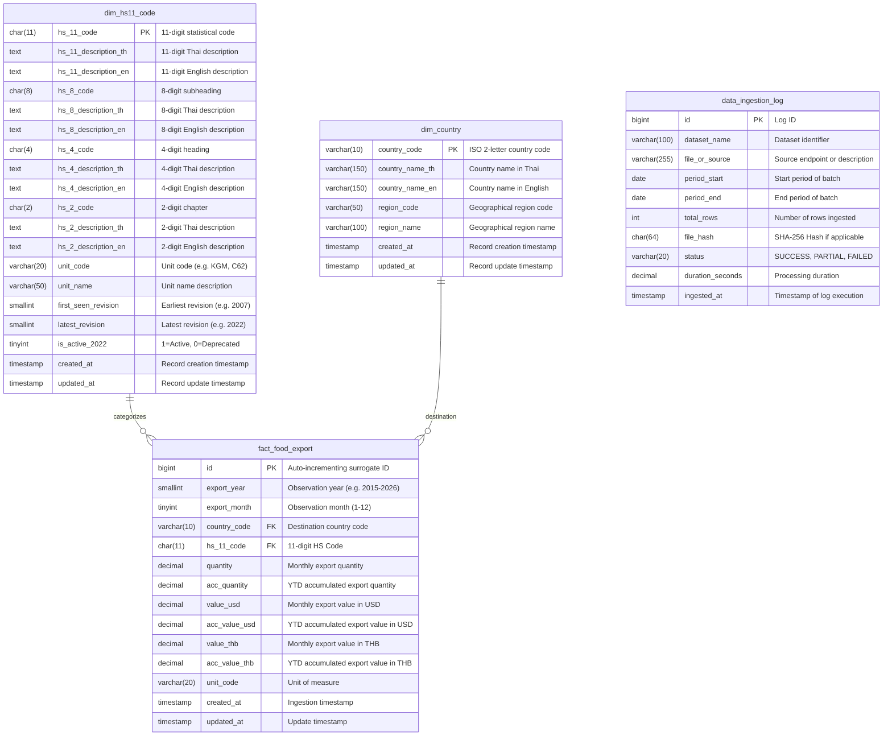

# Data Dictionary - Food & Commodity Export Data Warehouse (`food_export`)

## Overview
Database **`food_export`** is designed to store, manage, and analyze Thailand's international food and commodity export statistics sourced from the Ministry of Commerce (MOC Trade Report API).

---

## Entity-Relationship Diagram (ERD)

---

## Table Schemas

### 1. `dim_hs11_code` (Master Dimension: 4-Level HS Code Hierarchy)
- **Primary Key:** `hs_11_code`
- **Total Unique Codes:** 30,906 records (across 2007, 2012, 2017, 2022 revisions)
- **Hierarchy Columns:**
  - Level 2: `hs_2_code`, `hs_2_description_th`, `hs_2_description_en`
  - Level 4: `hs_4_code`, `hs_4_description_th`, `hs_4_description_en`
  - Level 8: `hs_8_code`, `hs_8_description_th`, `hs_8_description_en`
  - Level 11: `hs_11_code`, `hs_11_description_th`, `hs_11_description_en`

### 2. `dim_country` (Destination Countries & Geographical Regions)
- **Primary Key:** `country_code`

### 3. `fact_food_export` (Monthly Trade Export Facts)
- **Primary Key:** `id`
- **Unique Constraint:** (`export_year`, `export_month`, `country_code`, `hs_11_code`)

### 4. `data_ingestion_log` (Pipeline Audit & Observability)
- **Primary Key:** `id`
