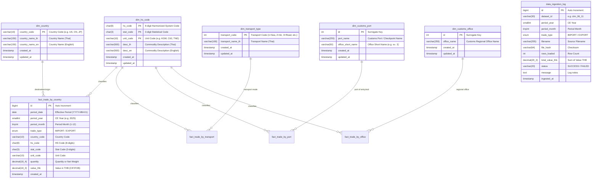

# Thai Customs Data Platform - Data Dictionary & Schema Documentation

## 1. Visual ER-Diagram

---

## 2. Table Specifications

### 2.1 Dimension Tables

#### Table: `dim_hs_code`
| Column Name | Data Type | Constraints | Description |
| :--- | :--- | :--- | :--- |
| `hs_code` | `CHAR(8)` | `PK (Part 1)` | พิกัดศุลกากร 8 หลัก (Pad 0 ด้านหน้าครบ 8 หลัก) |
| `stat_code` | `CHAR(3)` | `PK (Part 2)` | รหัสสถิติ 3 หลัก (Pad 0 ด้านหน้าครบ 3 หลัก) |
| `unit_code` | `VARCHAR(10)` | `PK (Part 3)` | หน่วยตามรหัสสถิติ เช่น KGM, C62, TNE |
| `desc_th` | `VARCHAR(500)` | - | คำอธิบายพิกัดภาษาไทย |
| `desc_en` | `VARCHAR(500)` | - | คำอธิบายพิกัดภาษาอังกฤษ |

#### Table: `dim_country`
| Column Name | Data Type | Constraints | Description |
| :--- | :--- | :--- | :--- |
| `country_code` | `VARCHAR(10)` | `PRIMARY KEY` | รหัสประเทศ 2 หลัก ISO Alpha-2 เช่น US, CN, JP, TH |
| `alpha_3` | `VARCHAR(10)` | `INDEX` | รหัสประเทศ 3 หลัก ISO Alpha-3 เช่น USA, CHN, JPN |
| `numeric_code` | `INT` | - | รหัสตัวเลขมาตรฐานประเทศ เช่น 840, 156, 764 |
| `country_name` | `VARCHAR(150)` | `NOT NULL` | ชื่อประเทศมาตรฐานสากล (ISO 3166) |
| `country_name_cia` | `VARCHAR(150)` | - | ชื่อประเทศตามนิยาม CIA |
| `region_cia` | `VARCHAR(100)` | `INDEX` | กลุ่มภูมิภาคตาม CIA (เช่น ASEAN, OTHER ASIA, OTHER EUROPE, AFRICA) |
| `iso_region` | `VARCHAR(100)` | `INDEX` | ทวีป/ภูมิภาคหลัก ISO (เช่น Asia, Europe, Americas, Africa, Oceania) |
| `iso_sub_region` | `VARCHAR(100)` | - | ภูมิภาคย่อย ISO (เช่น South-eastern Asia, Eastern Asia, Northern America) |
| `iso_intermediate_region`| `VARCHAR(100)` | - | ภูมิภาคระดับกลาง |
| `iso_3166_2` | `VARCHAR(50)` | - | รหัสอ้างอิงมาตรฐาน ISO 3166-2 |

#### Table: `dim_transport_type`
| Column Name | Data Type | Constraints | Description |
| :--- | :--- | :--- | :--- |
| `transport_code` | `INT` | `PRIMARY KEY` | รหัสประเภทการขนส่ง (1=ทางเรือ, 2=ทางอากาศ, 3=ทางรถยนต์ ฯลฯ) |
| `transport_name_th` | `VARCHAR(100)` | - | ชื่อประเภทการขนส่ง |

#### Table: `dim_customs_port`
| Column Name | Data Type | Constraints | Description |
| :--- | :--- | :--- | :--- |
| `id` | `INT` | `PK, AUTO_INCREMENT` | Surrogate Key |
| `port_name` | `VARCHAR(255)` | `UNIQUE (port_name, office)` | ชื่อด่าน/สถานที่รับบรรทุก |
| `office_short_name`| `VARCHAR(50)` | - | อักษรย่อสำนักงาน เช่น ศภ. 3 |

#### Table: `dim_customs_office`
| Column Name | Data Type | Constraints | Description |
| :--- | :--- | :--- | :--- |
| `id` | `INT` | `PK, AUTO_INCREMENT` | Surrogate Key |
| `office_name` | `VARCHAR(255)` | `UNIQUE` | ชื่อสำนัก/สำนักงานศุลกากร |

---

### 2.2 Fact Tables

1. **`fact_trade_by_country`**: ข้อมูลการนำเข้า-ส่งออก รายประเทศ (Dataset: `ctm_06_11`, `ctm_06_12`)
2. **`fact_trade_by_transport`**: ข้อมูลการนำเข้า-ส่งออก ตามประเภทการขนส่ง (Dataset: `ctm_06_17`, `ctm_06_18`)
3. **`fact_trade_by_port`**: ข้อมูลการนำเข้า-ส่งออก รายด่านศุลกากร (Dataset: `ctm_06_15`, `ctm_06_16`)
4. **`fact_trade_by_office`**: ข้อมูลการนำเข้า-ส่งออก รายสำนักงานศุลกากร (Dataset: `ctm_06_13`, `ctm_06_14`)
